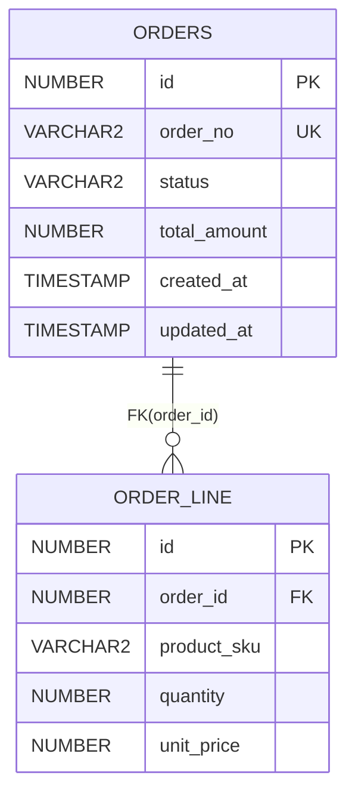
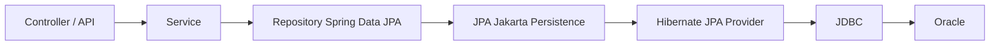

# Slides
### Slide 1 — Spring Data JPA & Transaction 公司内部工程培训

* 技术范围（按课程主线顺序）

  * **JDBC（简要介绍）**：在 Java 数据访问中的位置、典型工程特征、主要痛点
  * **Hibernate / JPA**：Entity 的角色与边界、Persistence Context、Dirty Checking（工程视角）
  * **Spring Data JPA**：Query Methods（Derived Query Methods）、`@Query` + JPQL、Specification、`Pageable` / `Sort`
  * **Spring 事务管理**：`@Transactional`、propagation（重点 REQUIRED / REQUIRES_NEW）、AOP 与 self-invocation 限制
* 数据库：**Oracle**
* 全课程示例数据模型：`orders` / `order_line`

---

### Slide 2 — 全课程唯一数据模型（orders / order_line）



* 关联方式：通过 `order_id` 字段建立逻辑关联
* 示例代码中不演示 entity 之间的对象关系映射（不写 `@OneToMany` / `@ManyToOne`），只保留 FK 值字段

---

### Slide 3 — JDBC 在整体调用链中的位置



* JDBC 是最底层的数据库访问入口：直接执行 SQL，处理参数绑定与结果集
* 上层的 Hibernate / JPA、Spring Data JPA 最终仍会落到 JDBC 与 Oracle 交互
* 后续 JDBC 小节会先用一段典型 JDBC 写法暴露工程成本，再自然过渡到 ORM / JPA 的抽象动机与边界


### Slide 4 — JDBC 示例：查询 orders 与 order_line（手写 SQL + 手动映射）

```java
String orderNo = "A20251229-0001";

String sqlOrder =
    "SELECT id, order_no, status, total_amount, created_at, updated_at " +
    "FROM orders WHERE order_no = ?";

String sqlLines =
    "SELECT id, order_id, product_sku, quantity, unit_price " +
    "FROM order_line WHERE order_id = ? ORDER BY id";

try (Connection conn = dataSource.getConnection();
     PreparedStatement ps1 = conn.prepareStatement(sqlOrder)) {

  ps1.setString(1, orderNo);

  OrderDto order;
  try (ResultSet rs = ps1.executeQuery()) {
    if (!rs.next()) return null;

    order = new OrderDto(
      rs.getLong("id"),
      rs.getString("order_no"),
      rs.getString("status"),
      rs.getBigDecimal("total_amount"),
      rs.getTimestamp("created_at").toInstant(),
      rs.getTimestamp("updated_at").toInstant()
    );
  }

  try (PreparedStatement ps2 = conn.prepareStatement(sqlLines)) {
    ps2.setLong(1, order.id());

    try (ResultSet rs2 = ps2.executeQuery()) {
      while (rs2.next()) {
        order.lines().add(new OrderLineDto(
          rs2.getLong("id"),
          rs2.getLong("order_id"),
          rs2.getString("product_sku"),
          rs2.getInt("quantity"),
          rs2.getBigDecimal("unit_price")
        ));
      }
    }
  }

  return order;
}
```

* SQL、参数绑定、`ResultSet` 映射都由业务代码承担
* 仅为了“查询一个订单 + 明细”，代码量已明显增长

---

### Slide 5 — JDBC 示例：创建 orders + 插入 order_line（手动 transaction 管理）

```java
try (Connection conn = dataSource.getConnection()) {
  conn.setAutoCommit(false);

  long orderId = nextOrderId(conn); // Oracle 常见：sequence / 自建取号逻辑

  try (PreparedStatement ps = conn.prepareStatement(
      "INSERT INTO orders(id, order_no, status, total_amount, created_at, updated_at) " +
      "VALUES(?, ?, ?, ?, ?, ?)")) {

    ps.setLong(1, orderId);
    ps.setString(2, orderNo);
    ps.setString(3, "CREATED");
    ps.setBigDecimal(4, totalAmount);
    ps.setTimestamp(5, Timestamp.from(now));
    ps.setTimestamp(6, Timestamp.from(now));
    ps.executeUpdate();
  }

  try (PreparedStatement ps = conn.prepareStatement(
      "INSERT INTO order_line(id, order_id, product_sku, quantity, unit_price) " +
      "VALUES(?, ?, ?, ?, ?)")) {

    for (LineInput line : lines) {
      ps.setLong(1, nextOrderLineId(conn));
      ps.setLong(2, orderId);
      ps.setString(3, line.sku());
      ps.setInt(4, line.qty());
      ps.setBigDecimal(5, line.unitPrice());
      ps.addBatch();
    }
    ps.executeBatch();
  }

  conn.commit();
} catch (Exception e) {
  // 需要处理 rollback、异常转换、资源释放
  throw e;
}
```

* transaction boundary、异常处理、rollback 都需要手动兜底
* “一组写入要么全成功要么全失败”的需求，需要代码显式保证

---

### Slide 6 — JDBC 在工程上的主要成本（后续模块的切入点）

| 关注点                  | JDBC 代码通常需要承担的工作                                       |
| -------------------- | ------------------------------------------------------ |
| 资源管理                 | `Connection / PreparedStatement / ResultSet` 关闭与异常分支覆盖 |
| transaction          | `setAutoCommit(false)`、`commit / rollback`、边界一致性       |
| 异常处理                 | SQL 异常转换、日志、可观测性、调用方语义一致性                              |
| 对象映射                 | `ResultSet` → DTO/对象；字段变更时同步修改映射代码                     |
| pagination / sorting | 手写 `ORDER BY`、`OFFSET/FETCH`（Oracle 语法与版本差异）           |
| dynamic filtering    | 条件拼接、参数列表同步、可读性与维护成本上升                                 |
| 复用与一致性               | 相同查询/写入逻辑在多个地方重复出现，难统一治理                               |


### Slide 7 — Hibernate / JPA：Entity（最小工程形态，Oracle）

```java
@Entity
@Table(name = "orders")
public class OrderEntity {

  @Id
  @GeneratedValue(strategy = GenerationType.SEQUENCE, generator = "orders_seq")
  @SequenceGenerator(name = "orders_seq", sequenceName = "orders_seq", allocationSize = 50)
  @Column(name = "id", nullable = false)
  private Long id;

  @Column(name = "order_no", nullable = false, length = 64, unique = true)
  private String orderNo;

  @Enumerated(EnumType.STRING)
  @Column(name = "status", nullable = false, length = 32)
  private OrderStatus status;

  @Column(name = "total_amount", nullable = false, precision = 18, scale = 2)
  private BigDecimal totalAmount;

  @Column(name = "created_at", nullable = false)
  private Instant createdAt;

  @Column(name = "updated_at", nullable = false)
  private Instant updatedAt;

  // getters/setters
}

public enum OrderStatus {
  CREATED, CONFIRMED, CANCELLED
}
```

* Entity 的职责：表达“持久化到表”的字段与约束语义
* `@Column(nullable/length/precision/scale/unique)`：用于从 Entity 生成 DDL 时体现约束（以 Oracle DDL 为目标）
* Oracle 常见主键策略：`SEQUENCE`（示例使用 `orders_seq`）

---

### Slide 8 — Hibernate / JPA：order_line 的映射（只保留 FK 值字段）

```java
@Entity
@Table(name = "order_line")
public class OrderLineEntity {

  @Id
  @GeneratedValue(strategy = GenerationType.SEQUENCE, generator = "order_line_seq")
  @SequenceGenerator(name = "order_line_seq", sequenceName = "order_line_seq", allocationSize = 50)
  @Column(name = "id", nullable = false)
  private Long id;

  @Column(name = "order_id", nullable = false)
  private Long orderId; // 只存 FK 值，不做 relationship mapping

  @Column(name = "product_sku", nullable = false, length = 64)
  private String productSku;

  @Column(name = "quantity", nullable = false, precision = 10, scale = 0)
  private Integer quantity;

  @Column(name = "unit_price", nullable = false, precision = 18, scale = 2)
  private BigDecimal unitPrice;

  // getters/setters
}
```

* 关联只通过 `orderId` 表达：查询时用显式条件或显式 join（后续 Spring Data JPA 小节展开）
* 不使用 `@ManyToOne/@OneToMany`：避免引入对象导航与 entity graph 的额外学习面

---

### Slide 9 — Persistence Context + Dirty Checking（工程可见效果）

```java
@Transactional
public void confirmOrder(String orderNo) {
  OrderEntity order = orderRepository.findByOrderNo(orderNo)
      .orElseThrow();

  order.setStatus(OrderStatus.CONFIRMED);
  order.setUpdatedAt(Instant.now());

  // 没有显式调用 save(...)
  // transaction commit 时可能仍会触发 update
}
```

* Persistence Context：同一个 transaction 内，Entity 被读取后进入“被管理”状态
* Dirty Checking：在 transaction commit 前，Hibernate 会对比字段变化并生成 `UPDATE orders ...`
* 常见误解点：

  * “我没写 update 为什么会更新”：通常就是 Dirty Checking 的结果
  * “我只想读不想写”：需要在 transaction 设计与代码路径上明确区分（后续事务小节展开）

### Slide 10 — Spring Data JPA：Repository（最常见入口）

```java
public interface OrderRepository extends JpaRepository<OrderEntity, Long> {

  Optional<OrderEntity> findByOrderNo(String orderNo);

  boolean existsByOrderNo(String orderNo);

  List<OrderEntity> findByStatus(OrderStatus status);
}

public interface OrderLineRepository extends JpaRepository<OrderLineEntity, Long> {

  List<OrderLineEntity> findByOrderIdOrderByIdAsc(Long orderId);
}
```

* Repository 的职责：封装最常见的 CRUD 与简单查询入口
* 默认方法来源：`JpaRepository`（`save/findById/deleteById` 等）
* 自定义方法：优先用 **Query Methods（Derived Query Methods）** 覆盖 80% 日常查询

---

### Slide 11 — Query Methods（Derived Query Methods）：常用写法速查

| 需求      | 方法名示例                                                                          |
| ------- | ------------------------------------------------------------------------------ |
| 按唯一键查   | `findByOrderNo(String orderNo)`                                                |
| 判断是否存在  | `existsByOrderNo(String orderNo)`                                              |
| 多条件 AND | `findByStatusAndTotalAmountGreaterThan(OrderStatus status, BigDecimal amount)` |
| 时间区间    | `findByCreatedAtBetween(Instant from, Instant to)`                             |
| 排序      | `findByStatusOrderByCreatedAtDesc(OrderStatus status)`                         |
| Top N   | `findTop20ByStatusOrderByUpdatedAtDesc(OrderStatus status)`                    |
| IN 条件   | `findByStatusIn(List<OrderStatus> statuses)`                                   |

* 方法名表达的是查询意图：字段名必须与 Entity 属性名一致
* 方法名可读性优先：复杂条件（多字段、多分支）通常不再适合继续堆方法名（后续用 `@Query` / Specification）

---

### Slide 12 — Pageable / Sort：分页与排序（工程里最常用形态）

```java
public interface OrderRepository extends JpaRepository<OrderEntity, Long> {

  Page<OrderEntity> findByStatus(OrderStatus status, Pageable pageable);

  Page<OrderEntity> findByCreatedAtBetween(Instant from, Instant to, Pageable pageable);
}
```

```java
Pageable p = PageRequest.of(0, 20, Sort.by("createdAt").descending());
Page<OrderEntity> page = orderRepository.findByStatus(OrderStatus.CREATED, p);
```

* `Pageable` 负责：page number / page size / sort
* 返回 `Page<T>`：包含当前页数据 + total count + total pages
* 常见边界：

  * `Sort.by("xxx")` 的字段名需要与 Entity 属性名一致
  * 排序字段缺索引时，Oracle 上容易出现明显的响应时间波动


### Slide 13 — `@Query` + JPQL：使用场景与边界

* 适用场景

  * Query Methods 难以表达：条件过多、需要显式 join、需要 projection
  * 需要稳定可读的查询语句（比“超长方法名”更清晰）
* 不适合继续堆 `@Query` 的场景

  * 大量可选条件组合（更适合 Specification）
  * 强依赖 Oracle 特定 SQL（可考虑 native query，但要控制范围）
* `@Query` 默认是 JPQL：面向 Entity/属性名，不是表/列名

---

### Slide 14 — `@Query` + JPQL：显式 join（无 relationship mapping）

```java
public interface OrderLineRepository extends JpaRepository<OrderLineEntity, Long> {

  @Query("""
    select l
    from OrderLineEntity l
    join OrderEntity o on l.orderId = o.id
    where o.orderNo = :orderNo
    order by l.id
  """)
  List<OrderLineEntity> findLinesByOrderNo(@Param("orderNo") String orderNo);
}
```

* 由于没有 `@ManyToOne`，只能用字段 `orderId` 显式 join
* JPQL 使用的是 `OrderLineEntity.orderId` / `OrderEntity.id` 等属性名
* 依赖点：`join ... on ...` 是 JPA 2.1 能力；Hibernate 一般支持（项目实际版本需一致）

---

### Slide 15 — `@Query`：projection 与写操作（工程常见两类）

**DTO projection（只取需要字段，避免把整行 Entity 都查出来）**

```java
public record OrderSummary(
    String orderNo,
    OrderStatus status,
    BigDecimal totalAmount,
    Instant updatedAt
) {}

public interface OrderRepository extends JpaRepository<OrderEntity, Long> {

  @Query("""
    select new com.acme.orders.OrderSummary(o.orderNo, o.status, o.totalAmount, o.updatedAt)
    from OrderEntity o
    where o.status = :status
    order by o.updatedAt desc
  """)
  List<OrderSummary> findSummariesByStatus(@Param("status") OrderStatus status);
}
```

**JPQL update（不走 Dirty Checking，直接执行更新语句）**

```java
public interface OrderRepository extends JpaRepository<OrderEntity, Long> {

  @Modifying
  @Query("""
    update OrderEntity o
    set o.status = :status,
        o.updatedAt = :updatedAt
    where o.orderNo = :orderNo
  """)
  int updateStatusByOrderNo(@Param("orderNo") String orderNo,
                            @Param("status") OrderStatus status,
                            @Param("updatedAt") Instant updatedAt);
}
```

* `@Modifying`：标记这是写操作（返回影响行数）
* 写操作通常需要在 transaction 内调用（后续 `@Transactional` 小节展开）
* JPQL update 不会触发 Persistence Context 内已加载实体的自动同步：同一 transaction 内既读又写时要注意一致性


### Slide 16 — Specification：解决“可选条件组合”的查询需求

* 适用场景

  * 搜索页 / 列表页：多个筛选条件都是可选的
  * 条件组合频繁变化：`status`、时间区间、金额区间、关键字等
* 为什么不用 Query Methods / `@Query` 硬写

  * Query Methods：方法名会爆炸（组合数量指数增长）
  * `@Query`：需要手写大量条件拼接版本，可读性与维护性快速下降
* Specification 的定位

  * 用 Java 代码组合查询条件（AND / OR）
  * 让“条件是否参与”由参数是否为空决定

---

### Slide 17 — Specification：Repository 形态与最常用调用方式

```java
public interface OrderRepository
    extends JpaRepository<OrderEntity, Long>,
            JpaSpecificationExecutor<OrderEntity> {
}
```

```java
public record OrderSearchCriteria(
    String orderNoPrefix,
    OrderStatus status,
    Instant createdFrom,
    Instant createdTo,
    BigDecimal minTotalAmount
) {}
```

```java
Page<OrderEntity> search(OrderSearchCriteria c, Pageable pageable) {
  Specification<OrderEntity> spec = Specification.where(null);

  if (c.orderNoPrefix() != null && !c.orderNoPrefix().isBlank()) {
    spec = spec.and((root, q, cb) ->
        cb.like(root.get("orderNo"), c.orderNoPrefix() + "%"));
  }
  if (c.status() != null) {
    spec = spec.and((root, q, cb) ->
        cb.equal(root.get("status"), c.status()));
  }
  if (c.createdFrom() != null && c.createdTo() != null) {
    spec = spec.and((root, q, cb) ->
        cb.between(root.get("createdAt"), c.createdFrom(), c.createdTo()));
  }
  if (c.minTotalAmount() != null) {
    spec = spec.and((root, q, cb) ->
        cb.greaterThanOrEqualTo(root.get("totalAmount"), c.minTotalAmount()));
  }

  return orderRepository.findAll(spec, pageable);
}
```

* `findAll(Specification, Pageable)`：动态过滤 + 分页排序的最常见组合
* 字段名使用 Entity 属性名：`orderNo/status/createdAt/totalAmount`

---

### Slide 18 — Specification：组合方式与常见误用

* 组合方式（工程常用）

  * AND：`spec.and(...)`
  * OR：`Specification.where(a).or(b)`
  * 抽成可复用片段：`OrderSpecs.hasStatus(...)`、`OrderSpecs.createdBetween(...)`
* 常见误用

  * 把所有条件都塞进一个超长 lambda：可读性差、难复用
  * 在 Specification 里手写排序：通常用 `Pageable` 的 `Sort` 统一处理
  * 复杂 join / 大量条件组合导致 SQL 变重：需要控制条件数量与索引匹配（Oracle 上更明显）
* 使用边界建议

  * 条件组合多 → Specification
  * 查询语义稳定且清晰 → `@Query` + JPQL
  * 简单等值/区间/TopN → Query Methods


### Slide 19 — Spring Transactions：`@Transactional` 在工程里做什么

* 目标：把一段业务代码包进一个 transaction boundary（对应 JDBC 的 `commit / rollback`）
* 常见写法位置

  * `@Transactional` 放在 **Service** 的 public 方法上
  * Repository 层通常不单独声明 transaction（除非非常明确的需要）
* 成功路径

  * 方法正常返回 → transaction commit
* 异常路径（默认规则）

  * 抛出 `RuntimeException` / `Error` → transaction rollback
  * 抛出 checked exception（`Exception` 但非 `RuntimeException`）→ 默认不 rollback（除非显式配置 `rollbackFor`)
* “只读”语义（工程常见用法）

  * `@Transactional(readOnly = true)`：表达“该方法以查询为主”，用于减少误用与意图澄清（并不等价于强制禁止写入）

---

### Slide 20 — propagation：REQUIRED / REQUIRES_NEW（最常用的两种）

| propagation  | 调用时外层已有 transaction | 行为                                   | 典型用途          |
| ------------ | ------------------- | ------------------------------------ | ------------- |
| REQUIRED     | 是                   | 加入外层 transaction，共同 commit/rollback  | 大多数业务写操作      |
| REQUIRED     | 否                   | 新开 transaction                       | 普通 Service 方法 |
| REQUIRES_NEW | 是                   | 挂起外层 transaction，单独开启一个新 transaction | “必须独立提交”的小段写入 |
| REQUIRES_NEW | 否                   | 新开 transaction                       | 独立写入任务        |

* REQUIRES_NEW 的工程含义

  * 内层 transaction **独立 commit**
  * 外层 transaction 后续即使 rollback，内层已提交的数据仍然存在
* 常见误用

  * 把 REQUIRES_NEW 当成“更安全”默认选项：会把一次业务动作拆成多个提交点，增加数据不一致的可能性

---

### Slide 21 — AOP 与 self-invocation：`@Transactional` 为什么有时“不生效”

```java
@Service
public class OrderService {

  private final OrderRepository orderRepository;
  private final OrderLineRepository orderLineRepository;

  public OrderService(OrderRepository orderRepository,
                      OrderLineRepository orderLineRepository) {
    this.orderRepository = orderRepository;
    this.orderLineRepository = orderLineRepository;
  }

  @Transactional
  public void placeOrder(...) {
    // 1) 写 orders / order_line
    // 2) 业务流程中需要一段“独立提交”的写入
    saveOrderSnapshotRequiresNew(...); // self-invocation
  }

  @Transactional(propagation = Propagation.REQUIRES_NEW)
  public void saveOrderSnapshotRequiresNew(...) {
    // 独立写入（示例：落一条状态记录/快照）
  }
}
```

* 现象：`placeOrder()` 内部直接调用 `saveOrderSnapshotRequiresNew()` 时，REQUIRES_NEW 经常不会按预期生效
* 原因：`@Transactional` 依赖 Spring AOP proxy 拦截调用；self-invocation 绕过 proxy，拦截器不触发
* 工程里常见、稳定的处理方式

  * 把 `saveOrderSnapshotRequiresNew(...)` 移到另一个 Spring bean（通过注入调用）
  * 或用 `TransactionTemplate` 显式包裹需要 REQUIRES_NEW 的代码块（把 transaction boundary 写清楚）

### Slide 22 — TransactionTemplate：显式 transaction boundary（含 REQUIRES_NEW）

```java
@Service
public class OrderWorkflow {

  private final TransactionTemplate txRequired;
  private final TransactionTemplate txRequiresNew;
  private final OrderRepository orderRepository;

  public OrderWorkflow(PlatformTransactionManager tm,
                       OrderRepository orderRepository) {
    this.orderRepository = orderRepository;

    this.txRequired = new TransactionTemplate(tm);
    this.txRequired.setPropagationBehavior(TransactionDefinition.PROPAGATION_REQUIRED);

    this.txRequiresNew = new TransactionTemplate(tm);
    this.txRequiresNew.setPropagationBehavior(TransactionDefinition.PROPAGATION_REQUIRES_NEW);
  }

  public void placeOrderAndConfirm(String orderNo) {
    txRequired.executeWithoutResult(s -> {
      OrderEntity o = new OrderEntity();
      o.setOrderNo(orderNo);
      o.setStatus(OrderStatus.CREATED);
      o.setCreatedAt(Instant.now());
      o.setUpdatedAt(Instant.now());
      orderRepository.save(o);
    });

    sendConfirmationEmail(orderNo);

    txRequiresNew.executeWithoutResult(s -> {
      orderRepository.updateStatusByOrderNo(
          orderNo, OrderStatus.CONFIRMED, Instant.now());
    });
  }

  private void sendConfirmationEmail(String orderNo) {
    // 外部动作：只作为方法调用出现
  }
}
```

* TransactionTemplate：把 transaction boundary 写成代码结构的一部分
* REQUIRES_NEW：用于“必须独立提交”的小段写入（这里是单独更新 `orders.status`）
* 适用场景：需要避免 self-invocation，或需要把 transaction 边界做得更显式

---

### Slide 23 — `@Transactional` 的 rollback 规则（工程里最容易踩的点）

* 默认 rollback 触发条件

  * 抛出 `RuntimeException` / `Error` → rollback
  * 抛出 checked exception → 默认不 rollback
* 常见配置

```java
@Transactional(rollbackFor = Exception.class)
public void doWork() { ... }
```

* 工程风险点

  * 代码里捕获异常后不再抛出 → transaction 可能 commit
  * 把“业务失败”转成返回值而非异常 → 需要显式决定是否 rollback（否则仍可能 commit）

---

### Slide 24 — `@Modifying` 更新与 Persistence Context 一致性

```java
@Modifying(clearAutomatically = true, flushAutomatically = true)
@Query("""
  update OrderEntity o
  set o.status = :status, o.updatedAt = :updatedAt
  where o.orderNo = :orderNo
""")
int updateStatusByOrderNo(...);
```

* JPQL update：直接执行更新语句，不通过 Dirty Checking
* 同一 transaction 内如果先 `findBy...` 再 `@Modifying update`

  * Persistence Context 里可能还持有旧的 Entity 状态
  * `flushAutomatically` / `clearAutomatically` 用于降低“读到旧数据”的概率
* 典型用法边界

  * 需要“批量更新 / 直接更新” → `@Modifying`
  * 需要“按对象语义修改 + 由 JPA 管理一致性” → 走 Entity + Dirty Checking

---

### Slide 25 — transaction boundary 的常见误用模式

* 把外部调用包进 transaction

  * 典型结构：`@Transactional` 方法里执行 DB 写入 + `sendConfirmationEmail(...)`
  * 风险：transaction 持有时间变长，锁与资源占用放大；失败时回滚路径更复杂
* 读写意图不清

  * 查询方法默认加上 `@Transactional`（未标 `readOnly = true`）后续代码路径里又改了字段 → 触发 Dirty Checking 更新
* 把 REQUIRES_NEW 当成默认选项

  * 业务流程被拆成多个独立提交点：出错时更容易出现“部分已提交、部分失败”的状态

### Slide 26 — Spring Data JPA：查询方式选择指南（工程常用）

| 需求特征                                  | 优先选择                                     | 典型例子                                                                          |
| ------------------------------------- | ---------------------------------------- | ----------------------------------------------------------------------------- |
| 条件简单、字段固定、可读性强                        | **Query Methods（Derived Query Methods）** | `findByOrderNo` / `existsByOrderNo` / `findTop20ByStatusOrderByUpdatedAtDesc` |
| 查询语义稳定但方法名会变长，或需要显式 join / projection | `@Query` + **JPQL**                      | “按 orderNo 查 lines” / “只返回 OrderSummary”                                      |
| 条件组合多、参数多为可选、列表页筛选常变                  | **Specification**                        | status 可选、时间区间可选、金额下限可选、orderNo 前缀可选                                          |

* 经验规则：先用 Query Methods 覆盖常见查询；方法名开始变长或需要 join/projection 时切到 `@Query`；可选条件爆炸时用 Specification

---

### Slide 27 — `@Transactional`：放置位置与边界控制（工程稳定写法）

* 常见放置位置

  * Service 的 public 方法：表达一次业务动作的 transaction boundary
* transaction 内建议只包含

  * 数据读写（Repository 调用）
  * 必要的业务校验与状态流转（在同一数据一致性范围内）
* transaction 外更常见的内容

  * 外部系统调用（如 `sendConfirmationEmail(...)`）
  * 可能明显变慢或不可控的操作（网络、文件、长耗时计算）
* propagation 使用习惯

  * 默认：**REQUIRED**
  * 只有在“必须独立提交”时才用 **REQUIRES_NEW**（并明确接受“外层 rollback 不影响内层已提交”的结果）

---

### Slide 28 — REQUIRES_NEW 的落地方式（避免 self-invocation）

| 方式                      | 写法特征                 | 适用场景                     |
| ----------------------- | -------------------- | ------------------------ |
| 拆到另一个 Spring bean       | 通过注入调用，AOP proxy 可拦截 | 逻辑清晰、独立职责明确              |
| **TransactionTemplate** | boundary 显式写在代码结构里   | 需要小范围独立提交、且希望避免分 bean 过多 |

* 选择建议

  * “独立提交”的逻辑本身就是一个明确职责 → 拆 bean
  * “独立提交”只是某个流程里的一个小块、且需要非常明确边界 → TransactionTemplate

---

### Slide 29 — 课程结束后应能做什么

* 能在项目中定位并正确使用这些概念：

  * **JDBC / Entity / Repository / Query Methods（Derived Query Methods） / Specification / Transaction**
* 能为常见需求选出“稳定可维护”的写法：

  * CRUD + 简单查询：Query Methods
  * join / projection / 稳定复杂查询：`@Query` + JPQL
  * 多可选条件组合：Specification
  * pagination/sorting：`Pageable` / `Sort`
* 能识别并规避常见误用：

  * **Dirty Checking** 触发的“意外更新”
  * `@Modifying` 与 Persistence Context 状态不一致导致的“读到旧数据”
  * `@Transactional` 因 **AOP / self-invocation** 未生效
  * **REQUIRES_NEW** 滥用导致的“部分提交、部分失败”状态

### Slide 30 — JDBC / JPA(Hibernate) / Spring Data JPA：职责边界对照

| 层级                       | 你写的代码主要是什么                                       | 框架帮你做了什么                                     | 常见边界                                          |
| ------------------------ | ------------------------------------------------ | -------------------------------------------- | --------------------------------------------- |
| **JDBC**                 | SQL、参数绑定、`ResultSet` 映射、`commit/rollback`        | 基本不做抽象                                       | 代码重复、transaction 易散落、映射易错                     |
| **JPA (API)**            | Entity 定义、基于对象的读写语义                              | 统一持久化 API                                    | 概念成本：Persistence Context、flush、entity state   |
| **Hibernate (Provider)** | 依赖其行为结果（SQL 生成、Dirty Checking）                   | persistence context 管理、Dirty Checking、SQL 生成 | “没写 update 也更新”、批量操作与一致性                      |
| **Spring Data JPA**      | Repository 接口 + 方法签名、少量 `@Query` / Specification | 常见 CRUD、Query Methods、分页排序整合                 | 方法名膨胀、复杂查询选择 `@Query` / Specification         |
| **Spring Transactions**  | `@Transactional` / TransactionTemplate 放置边界      | boundary、rollback 规则、与 AOP 集成                | self-invocation、REQUIRES_NEW 滥用、异常被吞导致 commit |

---

### Slide 31 — Entity 注解速查（Oracle DDL 视角）

| 注解 / 属性                                            | 主要作用     | 与 Oracle DDL 的对应                                 |
| -------------------------------------------------- | -------- | ------------------------------------------------ |
| `@Table(name=...)`                                 | 绑定表名     | `CREATE TABLE ...`                               |
| `@Id`                                              | 主键标识     | `PRIMARY KEY`                                    |
| `@GeneratedValue(SEQUENCE)` + `@SequenceGenerator` | 主键生成策略   | `CREATE SEQUENCE ...`（序列名、allocationSize 对应取号策略） |
| `@Column(nullable=false)`                          | 非空约束表达   | `NOT NULL`                                       |
| `@Column(length=64)`                               | 字符串长度    | `VARCHAR2(64)`                                   |
| `@Column(precision=18, scale=2)`                   | 数值精度/小数位 | `NUMBER(18,2)`                                   |
| `@Column(unique=true)`                             | 唯一约束表达   | `UNIQUE`（通常生成唯一约束/索引）                            |
| `@Enumerated(EnumType.STRING)`                     | 枚举持久化方式  | `VARCHAR2(...)`（存枚举名）                            |

* `nullable/length/precision/scale/unique` 的直接价值：从 Entity 反向生成 DDL 时可把约束带出来（避免只在数据库层才体现）

---

### Slide 32 — Repository 返回类型速查（工程常用）

| 返回类型           | 适用场景                         | 典型方法                                                  |
| -------------- | ---------------------------- | ----------------------------------------------------- |
| `Optional<T>`  | 唯一键/主键查询，可能不存在               | `findByOrderNo(...)`                                  |
| `T`            | “不存在就是异常”的语义                 | `getReferenceById(...)` / 自己 `orElseThrow()`          |
| `List<T>`      | 结果集不会太大、无需 total count       | `findByOrderIdOrderByIdAsc(...)`                      |
| `Page<T>`      | 需要 total count / total pages | `findByStatus(status, pageable)`                      |
| `boolean`      | 存在性判断                        | `existsByOrderNo(...)`                                |
| `long` / `int` | 计数或更新影响行数                    | `countByStatus(...)` / `@Modifying ... int update...` |

* 选择建议：列表页默认用 `Page<T>`（配合 `Pageable`）；纯下拉/小结果集用 `List<T>`

### Slide 33 — 常见现象：只想查询，却发生了 update

```java
@Transactional(readOnly = true)
public OrderEntity loadForView(String orderNo) {
  OrderEntity o = orderRepository.findByOrderNo(orderNo).orElseThrow();

  // 视图层需要一个“最后访问时间”，结果写回了 Entity
  o.setUpdatedAt(Instant.now());

  return o;
}
```

* `readOnly = true` 不等价于“禁止写入”
* Entity 进入 Persistence Context 后，被修改字段可能触发 **Dirty Checking** → `UPDATE orders ...`
* 常见稳定写法

  * 查询方法返回 DTO / projection（避免把 Entity 暴露给可能写入的代码路径）
  * 查询与写入分离：查询方法不做任何字段修改

---

### Slide 34 — 常见现象：业务失败了，但 transaction 还是 commit 了

**1）异常被捕获并吞掉**

```java
@Transactional
public void confirm(String orderNo) {
  try {
    sendConfirmationEmail(orderNo);
  } catch (Exception e) {
    // 记录日志但不抛出
  }

  orderRepository.updateStatusByOrderNo(
      orderNo, OrderStatus.CONFIRMED, Instant.now());
}
```

* 外部调用失败但未抛出异常 → transaction 仍可能 commit

**2）checked exception 默认不触发 rollback**

```java
@Transactional
public void confirm(String orderNo) throws Exception {
  validate(orderNo); // throws Exception (checked)
  orderRepository.updateStatusByOrderNo(...);
}
```

* 默认 rollback：`RuntimeException` / `Error`
* 需要按语义显式声明：

```java
@Transactional(rollbackFor = Exception.class)
public void confirm(String orderNo) throws Exception { ... }
```

---

### Slide 35 — `@Transactional` 不生效 / 行为不符合预期：排查清单

* 是否经过 Spring AOP proxy

  * 调用是否发生在 Spring bean 之间（注入调用）
  * 方法是否为 public（常见代理方式下更稳定）
  * 是否存在 self-invocation（同一个类内部直接调用）
* propagation 是否符合预期

  * REQUIRED 是否被误以为“新开 transaction”
  * REQUIRES_NEW 是否被 self-invocation 绕过
* Persistence Context 是否影响了你对结果的判断

  * 先 `findBy...` 再 `@Modifying update`：可能出现“读到旧状态”
  * 读写混用导致 **Dirty Checking** 的“意外 update”
* 结果校验方式

  * 看 SQL 日志（是否真正发出了 `INSERT/UPDATE/COMMIT`）
  * 同一 transaction 内的读取结果不等价于数据库已提交状态

### Slide 36 — 快速总结：按场景选用法（项目落地版本）

**查询类**

* 唯一键/简单条件：Query Methods（Derived Query Methods）

  * `findByOrderNo(...)` / `findByStatus(...)`
* 需要 join / projection / 查询语义稳定但复杂：`@Query` + JPQL

  * 显式 `join ... on ...`（无 relationship mapping）
* 可选条件组合、多筛选列表页：Specification + `Pageable`

**写入类**

* 常规写入：Service 层 `@Transactional`（默认 REQUIRED）
* 必须独立提交的小段写入：REQUIRES_NEW

  * 拆到另一个 Spring bean 或使用 TransactionTemplate

**一致性与边界**

* Entity 被修改可能触发 Dirty Checking → “没写 update 也更新”
* `@Modifying` 是直接更新语句 → 注意 Persistence Context 一致性
* `@Transactional` 依赖 AOP proxy → 注意 self-invocation

# Transcript

你要我开始生成 **Transcript（讲师讲稿）**，并且按 Step 输出；这一轮先覆盖 **Slides 1–3**。

---


### Slide 1 — Spring Data JPA & Transaction 公司内部工程培训

今天这门课围绕两条线展开：一条是数据访问从底层到上层的调用路径，另一条是事务在工程里如何落地，以及哪些边界最容易踩坑。

整体顺序按四个模块走：先用 JDBC 做一个简短的“底层写法”展示，让大家看到真实工程成本；然后过渡到 Hibernate / JPA，解释 Entity、Persistence Context、Dirty Checking 这些概念在工程里会造成的可见效果；接着进入 Spring Data JPA，覆盖日常最常用的 Query Methods（Derived Query Methods）、`@Query` + JPQL、Specification，以及分页排序 `Pageable` / `Sort`；最后讲 Spring Transactions：`@Transactional` 的常见用法、propagation（重点 REQUIRED / REQUIRES_NEW），以及 AOP / self-invocation 导致的事务不生效问题。

数据库统一用 Oracle。全课程的业务模型只用 `orders` 和 `order_line` 两张表，后面所有示例都围绕这个模型展开，方便把注意力集中在“用法与边界”，而不是业务扩展。

---

### Slide 2 — 全课程唯一数据模型（orders / order_line）

这里是两张表的结构：`orders` 是订单主表，`order_line` 是订单行表，通过 `order_line.order_id` 关联到 `orders.id`。

后续示例里会刻意不使用 ORM relationship mapping，也就是不写 `@OneToMany` / `@ManyToOne`。对应的做法是：在 `order_line` 里只保留一个普通字段 `orderId`，表达 FK 值；需要关联时，通过查询条件或显式 join 来完成。

这样做的直接结果是：大家在阅读查询时能清楚看到关联条件写在哪里；也避免把课程重点带到对象导航、entity graph、级联等额外概念上。课程的目标是让大家先把数据访问与事务的主线用法掌握稳，再在项目里按需要扩展。

---

### Slide 3 — JDBC 在整体调用链中的位置

这一页展示的是调用路径：上层是 Controller / API，然后是 Service，再到 Repository（Spring Data JPA）。Repository 底下是 JPA（Jakarta Persistence）这个 API 层，再往下是 Hibernate 作为 JPA Provider，最终落到 JDBC 与 Oracle 交互。

这里需要建立一个事实：不管上面写的是 Query Methods、JPQL 还是 Specification，最终都会被转换成 SQL，并通过 JDBC 发给 Oracle 执行。也就是说，JDBC 是底层不可绕开的接口层，上层框架做的是抽象与治理：减少重复代码、统一 transaction boundary、统一映射方式、以及提供更稳定的查询表达。

接下来进入 JDBC 小节时，会用一个典型的查询与写入例子把成本摊开，再用这些成本作为切入点过渡到 Hibernate / JPA 与 Spring Data JPA。


### Slide 4 — JDBC 示例：查询 orders 与 order_line（手写 SQL + 手动映射）

先看一个很典型的需求：按 `order_no` 查一张订单主表，再按 `order_id` 查明细表，然后把结果拼成一个返回对象。

在 JDBC 里，这件事通常拆成两段 SQL：一段查 `orders`，一段查 `order_line`。代码里需要显式做三类事情：第一是参数绑定，比如 `order_no = ?` 这种条件；第二是 `ResultSet` 到对象的字段映射，把列名一个个取出来放进 DTO；第三是资源管理，`Connection / PreparedStatement / ResultSet` 要在所有分支都正确关闭。

这里的关键点不是“能不能写”，而是这类代码在项目里会频繁出现，而且它的维护成本主要来自细节：字段多了要改映射、条件多了要改 SQL 和参数绑定、异常分支要保证资源释放。后面我们引入 JPA / Spring Data JPA，其实就是在降低这些重复劳动的比例，让团队把注意力放在查询语义和业务边界上。

---

### Slide 5 — JDBC 示例：创建 orders + 插入 order_line（手动 transaction 管理）

再看写入：创建一张 `orders`，然后插入多条 `order_line`。在 JDBC 里要显式控制 transaction boundary，最常见就是 `setAutoCommit(false)`，然后在所有插入都成功后 `commit()`，任何一个步骤失败都要 `rollback()`。

这里还会多一个现实问题：Oracle 下主键往往来自 `SEQUENCE` 或类似取号机制，所以你还得处理“先拿到主键，再插入明细”这种流程。除此之外，批量插入通常会用 `addBatch/executeBatch`，但是异常处理、失败后的清理、是否重试，这些都落在业务代码附近。

这页想强调的是：transaction 在 JDBC 层是显式的“流程控制代码”。而在 Spring 里，我们希望 transaction boundary 是可读、可复用、可统一治理的，所以会把它提升到 `@Transactional` 或 TransactionTemplate 这类方式来表达。

---

### Slide 6 — JDBC 在工程上的主要成本（后续模块的切入点）

这一页把前两页的成本做一个归纳，便于后面模块对照。

第一类是资源管理：JDBC 写得稳的代码往往很啰嗦，因为你要保证每个资源都被关闭，且异常分支不泄漏。

第二类是 transaction：boundary 分散在各个方法里，久了很难保证一致的 rollback 语义、异常传播语义，也不容易统一加监控和日志。

第三类是映射：`ResultSet` → 对象的映射是纯手工的。字段一多、表结构变更频繁时，最容易出现“漏映射”“映错列名”“类型转换问题”，而且通常是运行时才发现。

第四类是分页排序与动态过滤：一旦进入列表页查询，有 `ORDER BY`、分页、可选条件拼接，SQL 与参数列表就会快速膨胀，导致可读性和复用性都变差。

带着这些成本，我们接下来过渡到 Hibernate / JPA，看看框架帮你把哪些重复工作收走了，同时也会引入一些新的机制边界，比如 Persistence Context 与 Dirty Checking。


### Slide 7 — Hibernate / JPA：Entity（最小工程形态，Oracle）

从 JDBC 过渡到 JPA，第一件事是把“表结构”用 Entity 表达出来。Entity 的核心职责是：把一行数据映射成一个对象，并且把字段约束以注解的方式固定在代码里。

这里示例里用的是 Oracle 常见的主键策略：`SEQUENCE`。工程里你会看到 `@GeneratedValue(strategy = SEQUENCE)` 配合 `@SequenceGenerator`，序列名对应数据库里的 sequence。`allocationSize` 影响取号策略，通常是性能与“ID 连续性”之间的取舍点，课程里先把它当成一个工程参数，不展开讲优化细节。

`@Column` 上的 `nullable/length/precision/scale/unique` 这些属性，在工程里的直接价值是：当你用 Entity 反向生成 DDL 时，可以把约束带出来。也就是说，它不是为了在 Java 运行时做强校验，而是让“表结构语义”在代码层可见、可生成、可对齐。

`@Enumerated(EnumType.STRING)` 这类配置也属于同一目的：让枚举存数据库时是可读可追溯的字符串，而不是依赖 ordinal 的隐式顺序。

---

### Slide 8 — Hibernate / JPA：order_line 的映射（只保留 FK 值字段）

这一页是 `order_line` 的 Entity。这里有意只保留 `orderId` 这个普通字段，不引入 `@ManyToOne`。

这样做的效果是：你不会在代码里通过 `orderLine.getOrder().getOrderNo()` 这种对象导航去访问主表，而是通过查询显式表达关联，比如 `where l.orderId = :orderId`，或者在 JPQL 里写 `join ... on ...`。

工程上这种做法常见于两类团队：一类是希望降低 ORM 关系映射的学习与踩坑成本；另一类是数据访问更多以“明确 SQL/查询语义”为主，不希望对象图把查询隐藏掉。课程里统一用这种方式，是为了让后面讲 Query Methods、JPQL、Specification 时，关联条件都写在查询里，边界更清楚。

---

### Slide 9 — Persistence Context + Dirty Checking（工程可见效果）

从 JDBC 切到 Hibernate / JPA，最大的行为差异之一就是 Persistence Context 和 Dirty Checking。

在一个 `@Transactional` 方法里，当你通过 repository 把 Entity 查出来，这个对象会进入 persistence context，成为“被管理”的对象。后续你对它字段做的修改，不需要显式调用 `save()`，在 transaction commit 前，Hibernate 会对比字段变化并生成对应的 `UPDATE`，这就是 Dirty Checking。

工程里最常见的误解是：“我没写 update 为什么会更新”。如果你在 transaction 里拿到 Entity 又改了它的字段，那么即使没有显式保存，也可能会发生更新。

这不是 bug，而是 Hibernate 的默认工作方式。后面在事务模块会继续展开：如何在工程里避免“读路径写入”，比如查询返回 DTO、分离查询与写入、以及在必要时使用 `@Modifying` 做直接更新来绕开对象状态管理。


### Slide 10 — Spring Data JPA：Repository（最常见入口）

进入 Spring Data JPA 后，最常见的入口就是 Repository 接口。工程里通常会让 Repository 继承 `JpaRepository`，这样基础的 CRUD 就不需要自己实现了，比如 `save`、`findById`、`deleteById`。

在此基础上，你再补上项目里最常见、最稳定的查询方法。这里示例包括：按唯一键查 `findByOrderNo`，存在性判断 `existsByOrderNo`，以及按状态查列表 `findByStatus`。明细表这边用 `findByOrderIdOrderByIdAsc` 表达“按外键查并排序”。

这里要强调的是：Repository 层的目标是稳定、可读、可复用的访问入口。工程里通常会把“业务流程”放在 Service，把“数据访问”放在 Repository，让 transaction boundary 也更容易统一放到 Service 层表达。

---

### Slide 11 — Query Methods（Derived Query Methods）：常用写法速查

Derived Query Methods 的核心规则是：方法名表达查询意图，Spring Data JPA 会根据方法名解析出查询条件。你写的不是 SQL，而是“字段条件组合”。

这类方法在工程里非常常用，因为它们满足两个点：第一是可读性，方法名本身就说明了查询语义；第二是维护成本低，简单查询不需要再写一段 `@Query` 字符串。

表格里列的是最常见的类型：唯一键查询、exists、AND 组合、时间区间、排序、Top N、IN 条件。这些基本覆盖了日常项目里大量的“简单但频繁”的查询。

边界也很明确：当条件开始变多、方法名开始变长、或者你需要显式 join / projection 时，就不再适合继续堆方法名，后面会用 `@Query` 或 Specification 来解决。

---

### Slide 12 — Pageable / Sort：分页与排序（工程里最常用形态）

列表页在工程里基本都会遇到分页和排序。Spring Data JPA 的常见做法是：Repository 方法增加一个 `Pageable` 参数，然后返回 `Page<T>`。

`Pageable` 里包含 page number、page size，以及 `Sort`。`Page<T>` 除了当前页的数据，还包含 total count、total pages 这类信息，这对前端分页 UI 或 API 返回结构都很常见。

工程里需要注意的一个边界是：`Sort.by("createdAt")` 里的字段名是 Entity 的属性名，不是表列名。也就是说，它依赖的是 Java 层的字段命名。

另一个边界是数据库侧的性能：如果排序字段没有合适索引，Oracle 上排序分页可能会出现明显抖动。课程里不会做性能调优展开，但会把这个作为“为什么有时候同样的分页查询会很慢”的基础背景留在这里。


### Slide 13 — `@Query` + JPQL：使用场景与边界

当 Query Methods 不能很好表达你的需求时，下一步通常是 `@Query`。这里的关键是：`@Query` 默认写的是 JPQL，而不是原生 SQL。JPQL 面向的是 Entity 和属性名，不是表名和列名。

在工程里，`@Query` 很适合解决三类问题：第一，方法名已经开始变长，但查询语义其实很稳定，用一段查询语句反而更清楚；第二，你需要显式 join 或者更复杂的 where 条件；第三，你需要 projection，也就是不想把整行 Entity 查出来，只返回你需要的一部分字段。

不适合继续堆 `@Query` 的场景也很常见：当查询条件大量可选、组合非常多的时候，`@Query` 往往会演变成大量字符串拼接版本，这种维护成本一般会比 Specification 更差。

---

### Slide 14 — `@Query` + JPQL：显式 join（无 relationship mapping）

这一页展示一个在当前课程约束下很典型的例子：因为没有 relationship mapping，`OrderLineEntity` 里只有 `orderId`，没有 `order` 对象可以导航。

所以如果需求是“按 orderNo 查所有行”，你就需要显式 join：`join OrderEntity o on l.orderId = o.id`，然后 `where o.orderNo = :orderNo`。

这类写法的工程价值在于：关联条件完全可见，查询语义也更接近你在 SQL 里会写的结构。相应的代价是：你需要自己维护 join 条件，字段名变更时要同步修改 JPQL。

---

### Slide 15 — `@Query`：projection 与写操作（工程常见两类）

先看 projection。工程里列表页或详情页经常不需要把 Entity 所有字段都查出来，尤其是当 Entity 字段比较多时。JPQL 的 DTO projection 写法是：`select new ...(...)`，直接构造一个 DTO 或 record，只返回需要的字段。这样可以减少无用字段的读取，也能降低把 Entity 暴露到上层后被误修改的概率。

再看写操作。`@Modifying` + JPQL update 的常见用途是：你不想加载 Entity 再改字段，而是想直接执行一条更新语句，比如按 `orderNo` 更新状态和时间戳。这在批量更新或简单状态流转时很常见。

但这里有一个工程边界：JPQL update 不走 Dirty Checking，也不一定会自动同步 persistence context 里已经加载的实体状态。所以如果同一个 transaction 内你既读了某个 Entity，又用 `@Modifying` 更新了它，可能出现“内存里还是旧值”的情况。后面事务与一致性部分会把这个问题单独拉出来讲清楚。


### Slide 16 — Specification：解决“可选条件组合”的查询需求

进入列表页搜索场景时，最常见的复杂性不是单个条件难写，而是“条件是否参与查询”是动态的。比如 status 可能选也可能不选，时间区间可能只有开始没有结束，金额下限可能为空。这类组合一多，用 Query Methods 会让方法数量爆炸，用 `@Query` 会让查询字符串出现大量版本或拼接逻辑，维护成本会快速上升。

Specification 的定位就是把“条件拼装”交给 Java 代码，通过组合 AND/OR 的方式来生成最终查询。工程里它最常用于搜索页、过滤页、运营后台列表页这种“筛选条件多且可选”的地方。

---

### Slide 17 — Specification：Repository 形态与最常用调用方式

落地上，Repository 需要额外继承 `JpaSpecificationExecutor`，这样你就能调用 `findAll(spec, pageable)` 这一类方法。

常见做法是定义一个 criteria 对象承载搜索条件，然后按“非空才加入条件”的规则逐步 `spec.and(...)`。这样一来，哪些条件参与查询是清晰的，也方便把条件组装逻辑抽出来复用。

这里的工程关键点有两个：第一，`root.get("orderNo")` 这类字段名仍然是 Entity 属性名；第二，Specification 通常与 `Pageable` 一起使用，因为它最典型的场景就是“动态过滤 + 分页排序”的列表页。

---

### Slide 18 — Specification：组合方式与常见误用

Specification 的组合很简单，工程里最常见就是 AND 和 OR。更稳定的组织方式通常是把每个条件写成一个小的 spec 片段，例如 `hasStatus(...)`、`createdBetween(...)`，最后在 service 层组合起来。这样做比把所有条件塞进一个大 lambda 更好维护，也更容易单元测试。

常见误用有三类：第一，所有条件写在一个地方导致代码难读难改；第二，把排序也塞进 Specification，工程里更常见的是用 `Pageable` 的 `Sort` 统一处理排序；第三，条件组合越多 SQL 越重，Oracle 上尤其明显，所以在工程里需要控制筛选条件数量，并确保关键字段有匹配的索引，否则列表页性能会很不稳定。

这里也对应一个选择边界：条件组合多用 Specification；查询语义稳定但需要 join/projection 用 `@Query`；简单固定条件用 Query Methods。


### Slide 19 — Spring Transactions：`@Transactional` 在工程里做什么

从工程角度，`@Transactional` 解决的是：把一段业务代码的数据库读写包进一个明确的 transaction boundary，并且把 commit/rollback 的处理交给 Spring。

最常见、最稳定的放置位置是 Service 的 public 方法。原因是 Service 通常表达一次业务动作，而 transaction boundary 往往也应该和业务动作对齐。Repository 层更多负责数据访问，不建议到处分散 transaction 声明，除非你非常明确需要那样做。

默认 rollback 规则是工程里最常见的误解点：抛出 `RuntimeException` 或 `Error` 会 rollback；checked exception 默认不会 rollback，除非你用 `rollbackFor` 显式声明。这个规则会直接影响你对“出错时数据是否会回滚”的判断。

`readOnly = true` 这一类标注在工程里更多用于表达意图：该方法以查询为主，避免误用。它不等价于“强制禁止写入”，后面会用例子说明为什么仍然可能触发更新。

---

### Slide 20 — propagation：REQUIRED / REQUIRES_NEW（最常用的两种）

propagation 这块课程只抓两个最常见的：REQUIRED 和 REQUIRES_NEW。

REQUIRED 的含义是：外层已经有 transaction 就加入，没有就新开一个。绝大多数业务写操作都应该是 REQUIRED，因为它能保证一个业务动作内的多次写入是同一个提交点。

REQUIRES_NEW 的含义是：如果外层有 transaction，会先把外层挂起，然后开启一个全新的 transaction。它的工程语义是“独立提交”。所以它不是“更安全”的默认选项，而是一个非常明确的工具：你需要接受它带来的结果——内层已经提交的数据不会因为外层 rollback 而撤销。

工程里最常见的误用就是把 REQUIRES_NEW 当成习惯用法，导致一个业务流程被拆成多个提交点，一旦中间失败就更容易出现“部分提交、部分失败”的状态。

---

### Slide 21 — AOP 与 self-invocation：`@Transactional` 为什么有时“不生效”

`@Transactional` 依赖 Spring AOP proxy 拦截方法调用。也就是说，只有当调用路径经过 proxy，事务拦截器才会生效。

self-invocation 是最常见的问题：同一个类里，一个方法直接调用另一个标了 `@Transactional(propagation = REQUIRES_NEW)` 的方法，这个调用不会经过 proxy，因此 REQUIRES_NEW 很可能不按你预期工作。工程表现通常是：你以为开了新事务，但实际没有，或者行为和你理解的不一致。

这里的核心不是记住一个“坑点”，而是知道如何落地规避：要么把需要独立事务的方法拆到另一个 Spring bean，通过注入调用；要么用 TransactionTemplate 把边界写成显式代码结构。下一步会把 TransactionTemplate 的写法展开出来。


### Slide 22 — TransactionTemplate：显式 transaction boundary（含 REQUIRES_NEW）

TransactionTemplate 是一种更显式的事务写法：你不依赖注解 + AOP 拦截，而是把 transaction boundary 直接写在代码结构里。

这里示例里创建了两个 template：一个是 REQUIRED，一个是 REQUIRES_NEW。`placeOrderAndConfirm` 里先用 REQUIRED 做订单写入，然后在外部动作 `sendConfirmationEmail(...)` 之后，用 REQUIRES_NEW 做一次独立更新。

这类写法的工程价值是：边界非常直观，不存在 self-invocation 绕过 proxy 的问题。代价是：你需要自己组织 transaction 模板的创建与注入，代码结构会比纯注解更“显式”，但在需要严格控制边界的流程里，这种显式往往是优势。

---

### Slide 23 — `@Transactional` 的 rollback 规则（工程里最容易踩的点）

工程里判断“会不会回滚”，最容易踩的坑就是异常语义。

默认规则是：`RuntimeException` / `Error` 触发 rollback；checked exception 默认不 rollback。所以如果你定义的方法签名是 `throws Exception`，然后抛出的是 checked exception，默认可能还是 commit，这和很多人的直觉不一致。

另一个高频问题是“异常被吞”。比如 catch 住异常只记日志、不再抛出，Spring 会认为方法正常结束，transaction 就会 commit。也就是说，transaction 是否 rollback，最终取决于异常是否能以 Spring 认为“失败”的方式向外传播。

工程上更稳定的做法是：对“业务失败”要么转换成明确的 runtime exception 抛出，要么明确使用 `rollbackFor` 配置，不要让 rollback 语义依赖“开发人员碰巧抛了哪种异常”。

---

### Slide 24 — `@Modifying` 更新与 Persistence Context 一致性

这页讲的是一个经常在项目里出现的“一致性错觉”。

`@Modifying` + JPQL update 是直接执行更新语句，不走 Dirty Checking，也不需要加载 Entity。它适合做直接状态更新或批量更新。

但如果你在同一个 transaction 里先 `findBy...` 把 Entity 加载进 persistence context，然后又执行 `@Modifying update`，数据库层面确实更新了，但 persistence context 里可能还持有旧状态。接下来你再读这个 Entity，可能读到的还是内存里的旧值，从而出现“我明明 update 了，怎么还看到旧数据”的现象。

`flushAutomatically` / `clearAutomatically` 是常见的工程手段，用于降低这种状态不一致带来的误判。核心思路是：要么让写入及时 flush，要么清掉 persistence context，让后续读取重新从数据库拿状态。

---

### Slide 25 — transaction boundary 的常见误用模式

这里汇总几个真实项目里高频的误用。

第一类是把外部调用包进 transaction。比如在 `@Transactional` 里写 DB，再调用邮件、HTTP、文件等外部系统。问题不在“能不能工作”，而在 transaction 持有时间变长，锁和连接占用变大，失败分支更复杂，也更难排查。

第二类是读写意图不清。查询方法不小心修改了 Entity 字段，Dirty Checking 就可能把它写回数据库，导致“读路径写入”。

第三类是 REQUIRES_NEW 滥用。把它当默认会把一个业务动作拆成多个提交点，出现部分提交的概率显著增加。工程里通常只有在“必须独立提交”且你能接受独立提交后果时才用它，并且要把边界写得足够清楚。


### Slide 26 — Spring Data JPA：查询方式选择指南（工程常用）

这一页的目的是把前面三种查询手段放到同一个选择框架里，方便工程落地时快速决策。

如果需求是简单固定条件，比如按唯一键查、按状态查、TopN、区间查询，优先用 Query Methods。它的优势是语义直接体现在方法签名里，维护成本最低。

当你需要显式 join、需要 projection、或者方法名已经开始变长但查询语义稳定时，用 `@Query` + JPQL。它比“继续堆方法名”更可读，也更接近你在 SQL 里会写的结构。

当需求进入“可选条件组合”阶段，通常就是 Specification。它的优势是条件参与与否由参数控制，组合逻辑清晰，也适合与分页排序一起用。

---

### Slide 27 — `@Transactional`：放置位置与边界控制（工程稳定写法）

这一页强调的是“transaction boundary 应该放在哪里，以及边界里应该包含什么”。

工程里最常见的稳定做法是：把 `@Transactional` 放在 Service 的 public 方法上，让它对应一次业务动作。transaction 内主要包含数据库读写以及必须在同一一致性范围内完成的校验与状态流转。

外部系统调用通常更适合放在 transaction 外，因为它们耗时、失败模式不可控，而且会让 transaction 持有时间变长。这个点不需要上升到“原则”，只要理解工程后果：锁、连接、排查成本都会增加。

propagation 的使用习惯也在这里落地：默认 REQUIRED；只有在你明确需要独立提交，并且能接受独立提交后果时，才用 REQUIRES_NEW。

---

### Slide 28 — REQUIRES_NEW 的落地方式（避免 self-invocation）

REQUIRES_NEW 的核心问题不是注解怎么写，而是如何确保它真的生效。

如果你选择注解方式，最稳定的是把独立事务的方法拆到另一个 Spring bean，通过注入调用，让调用路径经过 AOP proxy，这样拦截器才能触发。

如果你更希望边界写得显式，或者独立提交只是流程中的一个小块，不想为了它拆太多 bean，可以用 TransactionTemplate，把 REQUIRED 和 REQUIRES_NEW 的 boundary 直接写在代码结构里。

工程上这两种方式的选择通常看团队习惯与可读性：拆 bean 更符合分层结构；TransactionTemplate 更强调边界显式。

---

### Slide 29 — 课程结束后应能做什么

这页是 wrap up，用来把课程的输出能力落到“日常项目里会做哪些决定”。

第一是能定位概念在项目里的位置：JDBC 在底层，Entity/Repository 在数据访问层，Query Methods/`@Query`/Specification 是三种查询表达方式，`@Transactional`/TransactionTemplate 是事务边界表达方式。

第二是能按场景选工具：简单固定条件用 Query Methods；join/projection/稳定复杂查询用 `@Query`；可选条件组合用 Specification；列表页用 `Pageable`/`Sort`。

第三是能识别并规避边界问题：Dirty Checking 的意外更新、`@Modifying` 的状态一致性、`@Transactional` 的 AOP/self-invocation 失效、以及 REQUIRES_NEW 滥用导致的部分提交状态。


### Slide 30 — JDBC / JPA(Hibernate) / Spring Data JPA：职责边界对照

这一页把不同层级在工程里分别负责什么做一个对照，便于之后在项目里定位问题来源。

JDBC 层你写的基本都是显式流程：SQL、参数绑定、结果集映射、commit/rollback。它的优势是完全可控，但代价是重复代码多、transaction 容易散落、映射错误更容易发生。

JPA 作为 API 层把持久化操作抽象成统一接口，你写的是 Entity 和对象语义；Hibernate 作为 provider 负责具体行为，比如 persistence context、Dirty Checking、SQL 生成。它解决了大量重复劳动，但也引入了“行为是自动发生的”这一类边界，比如“没写 update 也更新”。

Spring Data JPA 在 JPA 之上进一步工程化：通过 Repository 接口、Query Methods、分页排序整合，把“常见用法”变成约定化入口。它的边界更多是可读性与复杂度的选择：方法名膨胀就切 `@Query` 或 Specification。

Spring Transactions 则是把 transaction boundary 提升到业务层表达，统一 rollback 规则与边界治理。它最常见的边界是 AOP 代理调用链，以及 REQUIRES_NEW 的使用后果。

---

### Slide 31 — Entity 注解速查（Oracle DDL 视角）

这一页是为了让大家能在代码评审或排查时快速读懂 Entity 注解的“工程语义”。

`@Table`、`@Id` 这些是最基础的映射。Oracle 场景下 `SEQUENCE` 是常见主键生成策略，所以会看到 `@SequenceGenerator` 指定 sequenceName。

`@Column(nullable=false)` 对应 DDL 的 `NOT NULL`；`length` 对应 `VARCHAR2(n)`；`precision/scale` 对应 `NUMBER(p,s)`。`unique=true` 体现唯一约束，通常会生成唯一约束或唯一索引。

需要注意的是：这些属性在 Java 运行时并不会自动帮你做完备校验，它们更直接的价值是当你用 Entity 反向生成 DDL 时，约束能从代码层表达出来，避免只靠数据库脚本维护语义。

`@Enumerated(EnumType.STRING)` 则是让枚举以字符串形式落库，工程上更可读，也避免 ordinal 变更导致历史数据语义漂移。

---

### Slide 32 — Repository 返回类型速查（工程常用）

Repository 方法的返回类型在工程里也有语义差异。

`Optional<T>` 通常用于“可能不存在”的查询，比如按唯一键查订单。上层可以明确决定不存在时是返回空还是抛异常。

`List<T>` 适合小结果集或不需要 total count 的场景，比如按 `orderId` 查明细列表。

`Page<T>` 适合列表页，需要 total count、total pages 的场景，基本会配合 `Pageable` 一起出现。

`boolean` 常用于 exists 判断；`int/long` 常用于 count 或 `@Modifying` 更新返回影响行数。

工程上的选择习惯是：列表页优先 `Page<T>`；小结果集用 `List<T>`；唯一键查用 `Optional<T>`；更新语句用影响行数来判断是否命中预期记录。


### Slide 33 — 常见现象：只想查询，却发生了 update

这一页用一个很典型的例子说明：`@Transactional(readOnly = true)` 并不等价于“绝对不会写入”。

原因在于 persistence context 和 Dirty Checking 的机制：只要你在 transaction 内加载了 Entity，它就可能被 Hibernate 管理。如果后续代码路径里对它做了字段修改，即使你本意是“为了展示层做一点加工”，也可能在 commit 前被识别为脏数据并触发 `UPDATE orders ...`。

工程里更稳定的做法通常是两类：第一，查询路径返回 DTO / projection，让上层拿不到 Entity，从结构上避免误修改；第二，读写分离，查询方法不承担任何会改变持久化状态的逻辑。

这一页的重点不是纠结 readOnly 的细节，而是提醒：只要你让 Entity 进入 persistence context，就要对“修改字段会不会落库”有意识。

---

### Slide 34 — 常见现象：业务失败了，但 transaction 还是 commit 了

这页讲两个最常见的 commit 误判来源。

第一是异常被捕获并吞掉。比如外部调用失败了，你 catch 了异常只打日志不抛出。Spring 从 transaction 角度看方法是“正常结束”，所以会走 commit。工程后果是：你以为确认邮件失败就应该整体失败，但数据库状态已经提交了。

第二是 checked exception 默认不触发 rollback。很多工程代码里会写 `throws Exception` 或抛出一些 checked exception，如果没有配置 `rollbackFor`，默认可能还是 commit。这会导致“我明明抛异常了为什么数据没回滚”的排查困扰。

工程上要做的是把失败语义写清楚：要么用 runtime exception 表达失败并触发 rollback，要么明确声明 `rollbackFor`，不要让 rollback 行为依赖异常类型的偶然性。

---

### Slide 35 — `@Transactional` 不生效 / 行为不符合预期：排查清单

最后这一页是一个排查顺序。

先看调用链是否经过 Spring AOP proxy：是否是 bean 之间的注入调用；是否是 self-invocation；方法是否是 public（在常见代理模式下更稳）。

再看 propagation 是否符合预期：REQUIRED 是否被误解成“总会新开事务”；REQUIRES_NEW 是否被 self-invocation 绕过。

然后看 persistence context 是否影响你对结果的判断：同一 transaction 内先读再 `@Modifying`，可能出现内存状态与数据库不一致；读写混用可能触发 Dirty Checking 的意外更新。

最后是验证方式：工程排查时最终还是要看 SQL 日志，确认是否真正发出了 `INSERT/UPDATE`，以及 commit 的时点。尤其要区分“同一 transaction 内读到的值”与“数据库已提交后的状态”，这两者不总是一回事。


### Slide 36 — 快速总结：按场景选用法（项目落地版本）

最后把整门课收束到项目里最常见的决策点：你遇到一个需求时，怎么选写法，哪些边界需要立刻想到。

查询这块，先默认用 Query Methods（Derived Query Methods），它覆盖了大量简单但高频的需求，签名本身也清晰可读。如果查询开始需要显式 join、需要 projection、或者方法名已经变得不友好，但语义又很稳定，就切到 `@Query` + JPQL，把查询表达写成一段可读的语句。在筛选条件大量可选、组合会爆炸的场景，用 Specification，把“条件是否参与”变成代码逻辑，并且通常配合 `Pageable`/`Sort` 处理分页与排序。

写入这块，常规写入默认用 Service 层的 `@Transactional`，propagation 以 REQUIRED 为主，保证一次业务动作只有一个主要提交点。只有在你确实需要独立提交，并且能接受独立提交后果时才用 REQUIRES_NEW。落地时要避免 self-invocation：要么拆到另一个 Spring bean 通过注入调用，要么用 TransactionTemplate 把边界写成显式代码结构。

一致性与边界方面，有三个高频点需要在工程里保持敏感：第一，Entity 被修改可能触发 Dirty Checking，从而出现“没写 update 也更新”；第二，`@Modifying` 是直接更新语句，它与 persistence context 的状态一致性需要你额外关注；第三，`@Transactional` 的生效依赖 AOP proxy，所以调用链结构会直接影响事务行为。

这页的目的就是让大家在项目里看到一个具体问题时，能快速定位：这是查询表达选择问题、事务边界问题，还是 persistence context 行为导致的结果。
